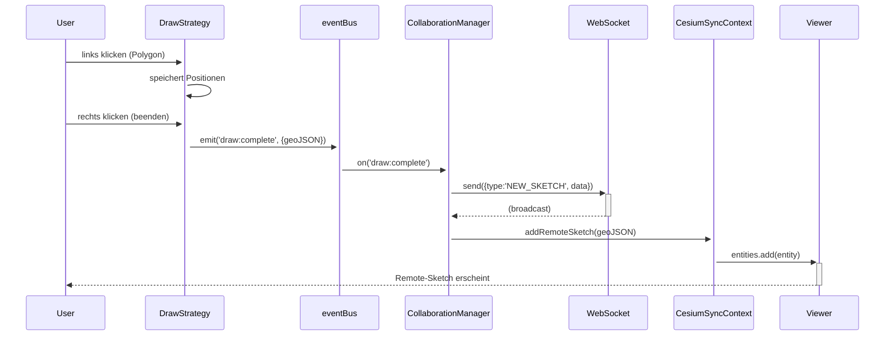

**Alte Kamerad, hier ist die vollständige Referenzarchitektur – von der Theorie bis zum produktionsreifen Code.🇩🇪**

Diese Referenz vereint alle diskutierten Konzepte: **FSD-Layering, Event-Pipeline, Mode-Manager, Strategies, Kollaboration, Multi-Viewport und Daten-Synchronisation** – alles aufeinander abgestimmt.

---

## 📁 1. Projektstruktur (FSD-konform)

```text
project_1/
├── src/
│   ├── app/
│   │   ├── App.vue
│   │   ├── main.ts
│   │   └── providers/
│   │       ├── CesiumProvider.ts      # init Viewer, inject singleton
│   │       └── CollaborationProvider.ts # WebSocket init, store injection
│   │
│   ├── pages/
│   │   └── map-view/
│   │       └── index.vue              # Hauptseite: Toolbar + Map
│   │
│   ├── widgets/
│   │   ├── cesium-toolbar/            # UI-Toolbar (deine Buttons)
│   │   │   ├── Toolbar.vue
│   │   │   └── ToolButton.vue
│   │   ├── cesium-viewer/             # Viewer-Widget (singleton)
│   │   │   ├── ui/
│   │   │   │   └── CesiumViewer.vue
│   │   │   └── lib/
│   │   │       └── ViewerSingleton.ts
│   │   └── layout-manager/            # für Multi-Viewport (optional)
│   │
│   ├── features/                      # Geschäftsanwendungsfälle
│   │   ├── interaction/               # 🎮 Interaktionskern
│   │   │   ├── core/
│   │   │   │   ├── IInteractionStrategy.ts
│   │   │   │   ├── EventDispatcher.ts     # einzige Event-Quelle
│   │   │   │   ├── ToolManager.ts         # Strategie-Router
│   │   │   │   └── ModeManager.ts         # Normal / Insert / Visual
│   │   │   ├── strategies/
│   │   │   │   ├── normal/
│   │   │   │   │   ├── SelectStrategy.ts
│   │   │   │   │   └── MoveStrategy.ts
│   │   │   │   ├── insert/
│   │   │   │   │   ├── DrawPointStrategy.ts
│   │   │   │   │   ├── DrawPolylineStrategy.ts
│   │   │   │   │   ├── DrawPolygonStrategy.ts
│   │   │   │   │   ├── DrawRectangleStrategy.ts
│   │   │   │   │   └── DrawCircleStrategy.ts
│   │   │   │   └── visual/
│   │   │   │       ├── SplitStrategy.ts
│   │   │   │       ├── MergeStrategy.ts
│   │   │   │       └── DeleteStrategy.ts
│   │   │   ├── sidecars/
│   │   │   │   └── GlobalKeyboardStrategy.ts   # ESC, i, v
│   │   │   └── model/
│   │   │       └── useModeManager.ts          # Vue-Composable
│   │   │
│   │   ├── sync/                      # 🌐 Kollaboration
│   │   │   ├── model/
│   │   │   │   ├── CollaborationManager.ts   # WS-Client + Event-Listener
│   │   │   │   └── RemoteSketchHandler.ts    # GeoJSON → Cesium Entity
│   │   │   └── ui/
│   │   │       └── CollaboratorCursors.vue
│   │   │
│   │   ├── data-io/                   # 📂 Import / Export
│   │   │   ├── ImportVector.ts
│   │   │   └── ExportVector.ts
│   │   │
│   │   └── geo-process/               # 🧮 Geometrie-Operationen
│   │       ├── SplitProcessor.ts     # Turf.js-basiert
│   │       └── MergeProcessor.ts
│   │
│   ├── entities/                      # 🧩 Geschäftsentitäten
│   │   ├── layer-tree/                # Layer-Baum (LinkedList)
│   │   │   ├── model/
│   │   │   │   ├── NodeFactory.ts
│   │   │   │   └── LinkedListManager.ts
│   │   │   └── lib/
│   │   │       └── CesiumSyncContext.ts   # Rendering-Adapter
│   │   └── drawing/                   # Zeichnungs-Entities (für Store)
│   │       └── DrawingStore.ts
│   │
│   └── shared/                        # 🔧 Infrastruktur
│       ├── lib/
│       │   ├── cesium/                # Cesium-spezifische Helfer
│       │   │   ├── CoordinateTransform.ts
│       │   │   └── ViewManager.ts     # Multi-Viewport (falls benötigt)
│       │   ├── event-bus/
│       │   │   └── mitt.ts            # globaler Event-Bus
│       │   └── websocket/
│       │       └── WebSocketClient.ts
│       ├── types/                     # globale Typdefinitionen
│       │   ├── layout.ts
│       │   ├── message.ts
│       │   └── node.ts
│       └── styles/
│           └── root.css
│
├── 1 Theory/                         # (deine Dokumentation)
├── package.json
├── vite.config.ts
└── tsconfig.json
```

---

## 🧩 2. Kern-Interfaces & Klassen (Auszüge)

### 2.1 `IInteractionStrategy.ts`

```typescript
export interface InteractionContext {
  originalEvent: PointerEvent | KeyboardEvent;
  screenPosition: Cartesian2;
  worldPosition?: Cartesian3 | { lng: number; lat: number };
  viewId: string;
  camera: Cesium.Camera | any; // plattformunabhängig
  stopped: boolean;
}

export interface IInteractionStrategy {
  activate?(): void;
  deactivate?(): void;
  onPointerDown?(ctx: InteractionContext): void;
  onPointerMove?(ctx: InteractionContext): void;
  onPointerUp?(ctx: InteractionContext): void;
  onKeyDown?(e: KeyboardEvent): void;
  onKeyUp?(e: KeyboardEvent): void;
}
```

### 2.2 `EventDispatcher.ts`

```typescript
export class EventDispatcher {
  private context: IInteractionStrategy | null = null;
  private middlewares: MiddlewareFn[] = [];

  constructor(private viewer: Viewer | any) {
    const target = viewer.scene?.canvas || viewer.getContainer();
    target.addEventListener('pointerdown', this.handleEvent);
    target.addEventListener('pointermove', this.handleEvent);
    target.addEventListener('pointerup', this.handleEvent);
    document.addEventListener('keydown', this.handleKey);
  }

  setContext(strategy: IInteractionStrategy | null) {
    this.context?.deactivate?.();
    this.context = strategy;
    this.context?.activate?.();
  }

  private handleEvent = (e: PointerEvent) => {
    const ctx = this.buildContext(e);
    this.runMiddlewares(ctx, () => {
      if (this.context && !ctx.stopped) {
        this.dispatch(ctx);
      }
    });
  };

  private dispatch(ctx: InteractionContext) {
    const s = this.context;
    if (!s) return;
    switch (ctx.originalEvent.type) {
      case 'pointerdown': s.onPointerDown?.(ctx); break;
      case 'pointermove': s.onPointerMove?.(ctx); break;
      case 'pointerup':   s.onPointerUp?.(ctx);   break;
    }
  }

  private handleKey = (e: KeyboardEvent) => {
    if (this.context) this.context.onKeyDown?.(e);
  };
}
```

### 2.3 `ModeManager.ts` (Vim-Philosophie)

```typescript
export type InteractionMode = 'normal' | 'insert' | 'visual';

export class ModeManager {
  private currentMode: InteractionMode = 'normal';
  private strategies: Record<InteractionMode, IInteractionStrategy> = {
    normal: new SelectStrategy(),
    insert: new DrawPolygonStrategy(), // wird später überschrieben
    visual: new DeleteStrategy(),
  };

  constructor(
    private dispatcher: EventDispatcher,
    private toolManager: ToolManager
  ) {
    this.activateMode('normal');
  }

  switchMode(mode: InteractionMode, subTool?: string) {
    if (this.currentMode === mode) return;
    // 1. Alte Strategie deaktivieren
    this.dispatcher.setContext(null);
    // 2. Neue Strategie holen (ggf. Sub-Tool setzen)
    let strategy = this.strategies[mode];
    if (mode === 'insert' && subTool) {
      strategy = this.toolManager.getDrawStrategy(subTool);
    }
    if (mode === 'visual' && subTool) {
      strategy = this.toolManager.getEditStrategy(subTool);
    }
    // 3. Aktivieren
    this.dispatcher.setContext(strategy);
    this.currentMode = mode;
    eventBus.emit('mode:changed', mode);
  }

  getCurrentMode() { return this.currentMode; }
}
```

---

## 🔄 3. Datenfluss – Lokal → Remote



---

## 🧪 4. Beispiel: `DrawPolygonStrategy` (Insert-Modus)

```typescript
export class DrawPolygonStrategy implements IInteractionStrategy {
  private positions: Cartesian3[] = [];
  private entity: Entity | null = null;

  constructor(
    private viewer: Viewer,
    private coordSys: ICoordinateSystem,
    private factory: IDrawEntityFactory<Cartesian3[]>
  ) {}

  activate() {
    this.positions = [];
    this.entity = this.factory.create();
    this.viewer.entities.add(this.entity);
    this.viewer.scene.screenSpaceCameraController.enableInputs = false;
  }

  deactivate() {
    if (this.entity) this.viewer.entities.remove(this.entity);
    this.viewer.scene.screenSpaceCameraController.enableInputs = true;
  }

  onPointerDown(ctx: InteractionContext) {
    const pos = this.coordSys.getWorldPosition(ctx.screenPosition);
    if (!pos) return;
    this.positions.push(pos);
    this.factory.update(this.positions);
  }

  onPointerMove(ctx: InteractionContext) {
    if (this.positions.length === 0) return;
    const pos = this.coordSys.getWorldPosition(ctx.screenPosition);
    if (!pos) return;
    this.factory.update([...this.positions, pos]); // Vorschau
  }

  onKeyDown(e: KeyboardEvent) {
    if (e.key === 'Escape') {
      this.deactivate();
      modeManager.switchMode('normal');
    }
    if (e.key === 'Enter' && this.positions.length >= 3) {
      this.finishDrawing();
    }
  }

  private finishDrawing() {
    const geoJSON = this.convertToGeoJSON(this.positions);
    eventBus.emit('draw:complete', { type: 'polygon', data: geoJSON });
    this.deactivate();
    modeManager.switchMode('normal');
  }
}
```

---

## 🌐 5. Kollaboration – `CollaborationManager`

```typescript
export class CollaborationManager {
  private ws: WebSocketClient;
  private syncContext: CesiumSyncContext;

  constructor(viewer: Viewer, syncContext: CesiumSyncContext) {
    this.syncContext = syncContext;
    this.ws = new WebSocketClient('wss://your-server/ws');
    this.ws.onMessage((msg) => this.handleRemoteMessage(msg));
    eventBus.on('draw:complete', (payload) => this.broadcastDraw(payload));
  }

  private broadcastDraw(payload: any) {
    this.ws.send({ type: 'NEW_SKETCH', ...payload, userId: this.userId });
  }

  private handleRemoteMessage(msg: any) {
    if (msg.type === 'NEW_SKETCH') {
      const node = NodeFactory.createNode({
        id: `remote-${msg.userId}-${Date.now()}`,
        label: `Koordinator ${msg.userId}`,
        type: 'sketch',
        parentid: 'collaboration-group',
        sketchData: msg.data,
        meta: { visible: true, isRemote: true }
      });
      this.syncContext.add(node); // → Viewer.entities.add(...)
      layerStore.addNode(node);
    }
  }
}
```

---

## 🖥️ 6. UI-Integration (Vue 3)

```vue
<!-- widgets/cesium-toolbar/Toolbar.vue -->
<template>
  <div class="toolbar">
    <ToolButton v-for="btn in buttons" :key="btn.id"
      :icon="btn.icon"
      :active="activeTool === btn.id"
      @click="onToolClick(btn)" />
  </div>
</template>

<script setup>
import { useModeManager } from '@/features/interaction/model/useModeManager';
const modeManager = useModeManager();

const buttons = [
  { id: 'select', mode: 'normal', sub: 'select', icon: 'fa-mouse-pointer' },
  { id: 'point',  mode: 'insert', sub: 'point', icon: 'fa-circle' },
  { id: 'line',   mode: 'insert', sub: 'polyline', icon: 'fa-pencil' },
  { id: 'polygon',mode: 'insert', sub: 'polygon', icon: 'fa-draw-polygon' },
  { id: 'split',  mode: 'visual', sub: 'split', icon: 'fa-cut' },
  { id: 'delete', mode: 'visual', sub: 'delete', icon: 'fa-trash' },
  // ... Weitere Buttons
];

const onToolClick = (btn) => {
  if (btn.mode) {
    modeManager.switchMode(btn.mode, btn.sub);
  } else {
    // IO-Aktionen
    if (btn.id === 'import') importVector();
    if (btn.id === 'export') exportVector();
  }
};
</script>
```

---

## 🧠 7. Performance-Tipps (direkt umsetzbar)

- **`EventDispatcher`-Middleware**: Throttle für `pointermove` (16ms).
- **`ViewManager`**: Bei Multi-Viewport nur die sichtbaren Viewports rendern.
- **`CesiumSyncContext`**: Bei Bulk-Import `viewer.entities.suspendEvents()` verwenden.
- **`DrawStrategy`**: `CallbackProperty` vermeiden, stattdessen `requestAnimationFrame` für animierte Vorschauen.

---

## ✅ 8. Abschließende Prüfliste für die Implementierung

- [ ] `ViewerSingleton` in `app/providers/CesiumProvider.ts` initialisieren.
- [ ] `EventDispatcher` & `ModeManager` in `features/interaction/core` anlegen.
- [ ] Alle `DrawXxxStrategy` in `insert/` umsetzen (jede mit eigenem Factory).
- [ ] `NormalPickStrategy` (Hover/Select) und `GlobalKeyboardStrategy` (Esc, i, v) einbinden.
- [ ] `CollaborationManager` in `features/sync` implementieren (WebSocket + EventBus).
- [ ] `CesiumSyncContext` in `entities/layer-tree/lib` als Rendering-Adapter nutzen.
- [ ] Toolbar-Widget anbinden, das über `useModeManager` die Modi schaltet.
- [ ] `ActionScheduler` (Microtask-Gate) für sequenzielle Verarbeitung von WS-Nachrichten einbauen.

---

**Damit hast du eine vollständige, von der Theorie bis zur Code-Ebene durchgängige Referenz.** Sie ist so aufgebaut, dass sie ohne großen Umbau für Leaflet/MapLibre/OpenLayers adaptiert werden kann – einfach die Cesium-spezifischen Teile (Koordinatenwandler, Rendering-Adapter) austauschen.

**Auf Wiedersehen, Kamerad – und viel Erfolg beim Bau deines Meisterwerks!** 🚀

*(Falls du noch konkreten Code für `SplitStrategy` oder `ViewManager` benötigst – sag Bescheid.)*